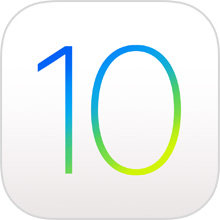
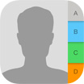
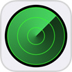
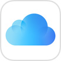
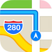
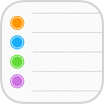
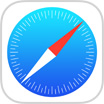
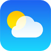

  

  
  
  
  

| Icon | App | Bundle Identifier |
| --- | --- | --- |
|  | App Store |  com.apple.AppStore |
|  | Apple Store | com.apple.store.Jolly |
|  | Apple Watch | com.apple.Bridge |
|  | Calculator | com.apple.calculator |
|  | Calendar | com.apple.mobilecal |
|  | Camera | com.apple.camera |
|  | Clock | com.apple.mobiletimer |
|  | Compass | com.apple.compass |
|  | Contacts | com.apple.MobileAddressBook |
|  | FaceTime | com.apple.facetime |
|  | Find Friends | com.apple.mobileme.fmf1 |
|  | Find iPhone | com.apple.mobileme.fmip1 |
|  | Game Center | com.apple.gamecenter |
|  | GarageBand | com.apple.mobilegarageband |
|  | Health | com.apple.Health |
|  | HomeKit | com.apple.Home |
|  | iBooks | com.apple.iBooks |
|  | iCloud Drive | com.apple.iCloudDriveApp |
|  | iMovie | com.apple.iMovie |
|  | iTunes Connect | com.apple.itunesconnect.mobile |
|  | iTunes Remote | com.apple.TVRemote |
|  | iTunes Store |  com.apple.MobileStore |
|  | iTunes U | com.apple.itunesu |
|  | Keynote | com.apple.Keynote |
|  | Mail | com.apple.mobilemail |
|  | Maps | com.apple.Maps |
|  | Messages | com.apple.MobileSMS |
|  | Music | com.apple.Music |
|  | Music Memos | com.apple.musicmemos |
|  | News | com.apple.news |
|  | Notes | com.apple.mobilenotes |
|  | Numbers | com.apple.Numbers |
|  | Pages | com.apple.Pages |
|  | Phone | com.apple.mobilephone |
| | Photo Booth | com.apple.Photo-Booth |
|  | Photos | com.apple.mobileslideshow |
|  | Podcasts | com.apple.podcasts |
|  | Reminders | com.apple.reminders |
|  | Remote | com.apple.Remote |
|  | Safari | com.apple.mobilesafari |
|  | Settings | com.apple.Preferences |
|  | Siri |  |
|  | Stocks | com.apple.stocks |
|  | Tips | com.apple.tips |
|  | Trailers | com.apple.movietrailers |
|  | Videos | com.apple.videos |
|  | Voice Memos |  com.apple.VoiceMemos |
|  | Wallet | com.apple.Passbook |
|  | Weather | com.apple.weather |
